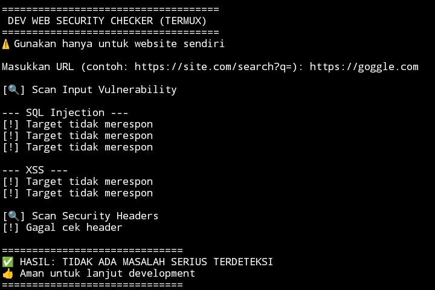

# WebSec Scan 🔐

WebSec Scan adalah tools **early web security checker** untuk developer web.  
Dirancang untuk membantu mendeteksi **kerentanan dasar** sebelum website di-deploy ke production.

Tools ini **tidak merusak database** dan **aman digunakan untuk development**.

---

## ✨ Fitur Utama
- Deteksi SQL Injection (basic)
- Deteksi XSS (reflected)
- Cek security headers penting
- Berjalan di Termux / Linux / Windows
- Cocok untuk pre-deploy checking

---

## 🎯 Untuk Siapa?
- Web Developer
- Backend Developer
- Mahasiswa IT
- Belajar secure coding
- Quality check sebelum deploy

---

## 🛠️ Instalasi

### Termux / Linux
```bash
pkg install python git
pip install requests
git clone https://github.com/USERNAME/websec-scan
cd websec-scan
python websec_scan.py
## 📸 Screenshot


